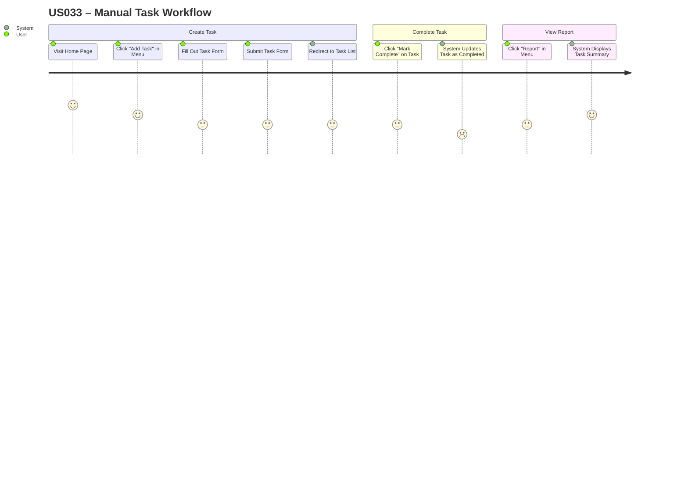

## 🧭 User Journey – US033: Manual Task Workflow

This user journey describes how a typical user interacts with the Task Tracker application to complete the end-to-end task management workflow. This reflects the current "as-is" state of the application, implemented in Sprint 4.

---

### 👤 User Role: End User

### 🎯 Goal: Create a task, complete it, and view a task report



---

### 🧪 Automated Testing Coverage

This user journey is validated through comprehensive BDD (Behavior-Driven Development) tests that ensure each step works correctly and the complete workflow functions as expected.

#### Test Implementation
- **Framework**: pytest-bdd + Playwright for browser automation
- **Location**: `tests/acceptance/bdd_playwright/`
- **Feature File**: `task_workflow_playwright.feature`
- **Test Suite**: 3 scenarios covering the complete US033 workflow

#### Test Scenarios
1. **Complete task workflow with Playwright** - Full end-to-end journey
2. **Simple task creation workflow** - Focused task creation validation  
3. **Task creation and verification workflow** - Creation with verification steps

#### Running Tests
```bash
# Activate virtual environment
.\.venv\Scripts\Activate.ps1

# Run BDD tests with detailed output
pytest tests/acceptance/bdd_playwright/test_playwright_pytestbdd.py -v -o addopts=''

# Run with HTML report generation
.\test_helpers\bdd_pytest.ps1 -Headed -JUnit -Html

# Generate custom BDD scenario report
python scripts/generate_bdd_report.py
```

#### Test Coverage Mapping
| User Journey Step | BDD Test Step | Validation |
|-------------------|---------------|------------|
| Visit Home Page | Given I am on the home page | URL verification |
| Fill Out Task Form | When I fill in the task form with... | Form field population |
| Submit Task Form | When I submit the form | Form submission |
| Redirect to Task List | Then I should see the task in the list | Task presence verification |
| Click "Mark Complete" | When I click the "Mark Complete" button | Button interaction |
| System Updates Task | Then the task should be marked as completed | Status verification |
| Click "Report" in Menu | When I navigate to the "Report" page | Navigation verification |
| System Displays Summary | Then I should see the task report | Report content validation |

#### Business Value
- **Confidence**: Automated validation ensures the user journey works consistently
- **Regression Prevention**: Tests catch breaking changes before they reach users
- **Documentation**: Test scenarios serve as executable specifications
- **Quality Assurance**: Validates both happy path and edge cases

#### Development Integration
- Tests run automatically during CI/CD pipeline
- Can be executed locally during development
- Reports provide detailed feedback on test results
- Supports both headless and headed browser testing

---

### 📝 Notes

* This journey supports validation for **US012**, **US026**, and **US027**.
* Each step corresponds to UI elements implemented in Flask templates.
* The flow can be tested using automated tools like **Selenium**, **Playwright**, or **Robot Framework**.

UX update: The application now redirects the home page (`/`) directly to the Add Task form (`/tasks/new`). This streamlines the experience for users who intend to create tasks immediately. As a result, the explicit "Click 'Add Task' in Menu" step may be skipped in practice — the user lands directly on the form upon visiting the site. If you prefer the original step (visit home, then click Add Task), change the home route to render a landing page instead of auto-redirecting.

### 🔗 Linked Artifacts

* Referenced in: `tt_user_stories.md` (US033)

