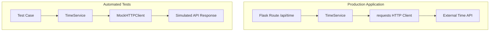

# Mini Lab – Improving the TimeService for Testability

### Sprint 1 – Group Project Enhancement

---

## Objective

In this mini lab, your team will refactor the **TimeService** so that it supports **dependency injection for the HTTP client**.

Currently, the service directly calls the external API using the `requests` library. While this works, it tightly couples the service to a specific HTTP client and makes automated testing more difficult.

You will modify the service so that the HTTP client can be **injected as a dependency**, allowing automated tests to use a **mock HTTP client instead of calling the real external API**.

This is a common professional practice used to make software **more testable, maintainable, and modular**.

⚠️ **Important**

This lab **does NOT change the method name or return structure** of the service.

The method must remain:

```
get_current_time()
```

The returned response must continue to contain:

```
utc_datetime
source
```

You are only refactoring **how the HTTP request is made**.

---

## Connection to Earlier Dependency Injection

Earlier in the project, dependency injection was introduced when services were passed into the Flask application during initialization.

Example:

```python
create_app(task_service=TaskService(repository))
```

Architecture:

```
Flask App
   ↓
TaskService
   ↓
TaskRepository
```

This allowed the repository to be replaced with a **mock repository during testing**.

In this mini lab, you will apply the **same dependency injection concept** to the HTTP client used by `TimeService`.

---

## Current Design

The current implementation directly calls the external API using `requests`.

Conceptual flow:

```
TimeService
   ↓
requests.get()
   ↓
External Time API (timeapi.io)
```

Example pattern from the service:

```python
response = requests.get(
    "https://timeapi.io/api/Time/current/zone?timeZone=UTC",
    timeout=3,
    headers=headers
)
```

Because `requests` is hard-coded, the HTTP client cannot easily be replaced during testing.

---

## Refactored Design

After the refactor, the HTTP client will be **injected into the service**.

```
TimeService
   ↓
Injected HTTP Client
   ↓
External Time API
```

This allows automated tests to replace the real HTTP client with a **mock implementation**.

---

## How Mocking Replaces the Real API

### Normal Application Behavior

```
Flask Route (/api/time)
        ↓
     TimeService
        ↓
   requests Client
        ↓
 External Time API
```

### Automated Test Behavior

```
Test Case
   ↓
TimeService
   ↓
MockHTTPClient
   ↓
Simulated API Response
```

The service does not need to know whether the HTTP client is real or mocked.

---

## Dependency Injection and Mocking (Visual Explanation)

The following diagram shows how dependency injection allows the application to replace the real HTTP client during testing.


---

In the production application, the TimeService calls the real HTTP client,
which communicates with the external time API.

During automated tests, the HTTP client is replaced with a MockHTTPClient.

The mock simulates the API response, allowing tests to run quickly
and reliably without depending on an external service.

---

## GitHub Planning (Epic + Issues)

As part of this mini-lab, your team must create an **Epic issue and sub-issues** in your GitHub repository **before beginning implementation**.

This reflects how professional teams track work during a sprint.

Your team will create:

```
1 Epic Issue
3 Sub-Issues
```

The Epic describes the **overall architectural improvement**, and the sub-issues represent the **implementation tasks**.

---

### Step 1 – Create the Epic Issue

Create a new GitHub Issue with the following template.

### Title

```
EPIC: Refactor TimeService for HTTP Client Dependency Injection
```

### Description

```
This Epic refactors the TimeService so that the HTTP client used to call
the external time API can be injected as a dependency.

Currently, the service directly calls `requests.get()`, which tightly
couples the service to the requests library and makes automated
testing more difficult.

This refactor introduces dependency injection for the HTTP client
so that tests can use a mock HTTP client instead of calling the real
external API.

This change improves:

- testability
- modularity
- architectural consistency
- reliability of automated tests

The service method name and response format must remain unchanged.

Method:
get_current_time()

Response keys:
utc_datetime
source
```

### Acceptance Criteria

```
□ TimeService accepts an injected HTTP client
□ requests.get() is replaced with self.http_client.get()
□ A mock HTTP client can simulate the API response
□ A unit test verifies the service using the mock client
□ The /api/time endpoint still works
```

### Labels (if used)

```
epic
refactor
architecture
testing
```

---

### Step 2 – Create Sub-Issues

Each Epic should contain the following sub-issues.

---

### Sub-Issue 1 – Refactor TimeService for HTTP Client Injection

#### Description

```
Modify the TimeService so that the HTTP client used to call the external API
can be injected through the constructor instead of directly calling
requests.get().
```

#### Tasks

```
□ Add constructor with http_client parameter
□ Default to requests if no client provided
□ Replace requests.get() with self.http_client.get()
□ Confirm service still works
```

#### Suggested Branch

```
refactor/time-service-http-client
```

---

### Sub-Issue 2 – Create Mock HTTP Client

#### Description

```
Create a mock HTTP client that simulates the response of the external
time API so that automated tests do not call the real external service.
```

#### Tasks

```
□ Create tests/mocks directory
□ Create mock_http_client.py
□ Implement MockHTTPClient
□ Simulate API response
```

#### Suggested Branch

```
feature/mock-http-client
```

---

### Sub-Issue 3 – Add Unit Test for TimeService

#### Description

```
Create a unit test that verifies the TimeService works correctly when
a mock HTTP client is injected.
```

#### Tasks

```
□ Create tests/services/test_time_service.py
□ Import TimeService
□ Import MockHTTPClient
□ Instantiate service with mock client
□ Verify expected response
```

#### Suggested Branch

```
test/time-service-mock
```

---

# Implementation Steps

Follow these steps carefully.

⚠️ Only refactor **how the HTTP request is made**.

Do **not modify**:

* the method name (`get_current_time`)
* the return structure
* the fallback logic

---

### Step 1 – Open the TimeService File

Open:

```
app/services/time_service.py
```

Locate the class:

```
TimeService
```

You will modify this service to support dependency injection.

---

### Step 2 – Add Dependency Injection to the Constructor

Modify the `TimeService` constructor to accept an HTTP client.

Add the following constructor:

```python
import requests
class TimeService:

    def __init__(self, http_client=None):
        self.http_client = http_client or requests
```

Explanation:

| Parameter   | Purpose                                   |
| ----------- | ----------------------------------------- |
| http_client | allows tests to inject a mock HTTP client |
| requests    | default client used by the application    |

---

### Step 3 – Replace the Direct API Call

Locate this line in the service:

```python
response = requests.get(...)
```

Replace it with:

```python
response = self.http_client.get(...)
```

Example:

```python
response = self.http_client.get(
    "https://timeapi.io/api/Time/current/zone?timeZone=UTC",
    timeout=3,
    headers=headers
)
```

⚠️ Do **not modify any other logic** in the method.

---

**Implementation Safety Check**

After completing the refactor, confirm the following conditions are still true.

□ The method name remains get_current_time()
□ The service still imports requests
□ The constructor sets the default client using:

   self.http_client = http_client or requests

□ The API call now uses:

   self.http_client.get(...)

□ The returned response still includes:

   utc_datetime
   source

> hint: The `or` operator ensures that the real requests library is used when no mock client is provided.`

### Step 4 – Create a Mock HTTP Client

Create the file:

```
tests/mocks/mock_http_client.py
```

Add this implementation:

```python
class MockHTTPClient:
    """
    Mock HTTP client used for automated testing.
    Simulates the behavior of the external Time API.
    """

    def get(self, url, timeout=3, headers=None):

        class MockResponse:

            def raise_for_status(self):
                pass

            def json(self):
                return {"dateTime": "2025-01-01T12:00:00"}

        return MockResponse()
```

Important:
The mock must implement both methods:

```
raise_for_status()
json()
```

These are required because the service calls them.

---

### Step 5 – Create a Unit Test

Create the test file:

```
tests/services/test_time_service.py
```

Add the following test:

```python
from app.services.time_service import TimeService
from tests.mocks.mock_http_client import MockHTTPClient


def test_time_service_with_mock():

    service = TimeService(http_client=MockHTTPClient())

    result = service.get_current_time()

    assert result["utc_datetime"] == "2025-01-01T12:00:00"
```

This test verifies that the service works correctly with a mocked HTTP client.

---

### Step 6 – Verify the API Endpoint

Run the application and test the endpoint:

```
GET /api/time
```

Example response:

```json
{
  "utc_datetime": "2026-03-12T18:20:11",
  "source": "TimeAPI.io (External)"
}
```

The endpoint should continue working normally.

---

## Connection to Future Sprints

This refactor prepares the project for:

* external service mocking
* Robot Framework acceptance testing
* more reliable CI pipelines
* future service integrations

These practices are widely used in **professional software engineering teams**.

---

## Mini Lab Deliverables

Each team must complete the following:

```
□ Created Epic issue in GitHub
□ Created 3 sub-issues linked to the Epic
□ Updated TimeService to support injected HTTP client
□ Created MockHTTPClient
□ Added unit test using the mock client
□ Verified /api/time endpoint still works
□ Submitted Pull Requests for each sub-issue
```

---

### Recommended Completion Order

```
1. Refactor TimeService
2. Create MockHTTPClient
3. Write Unit Test
```

