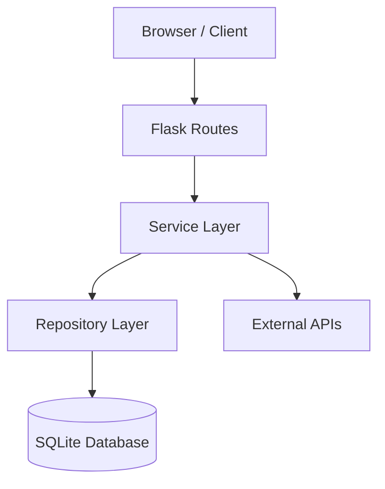
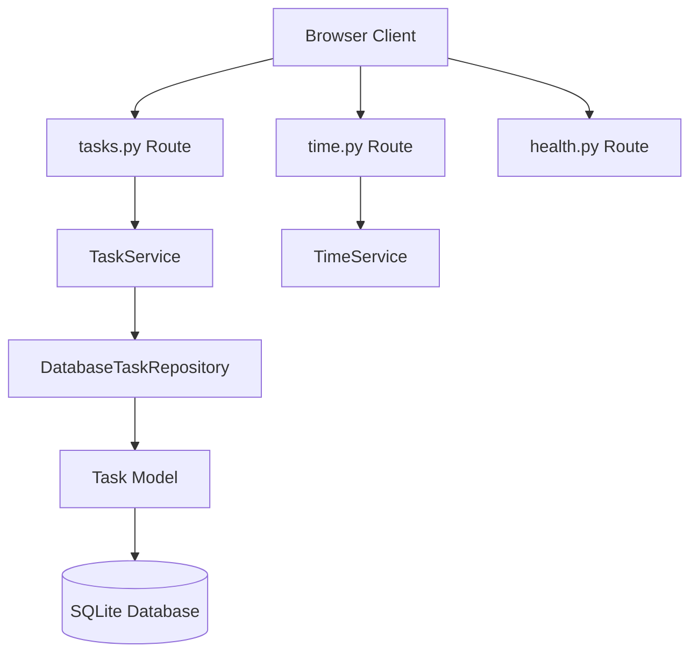
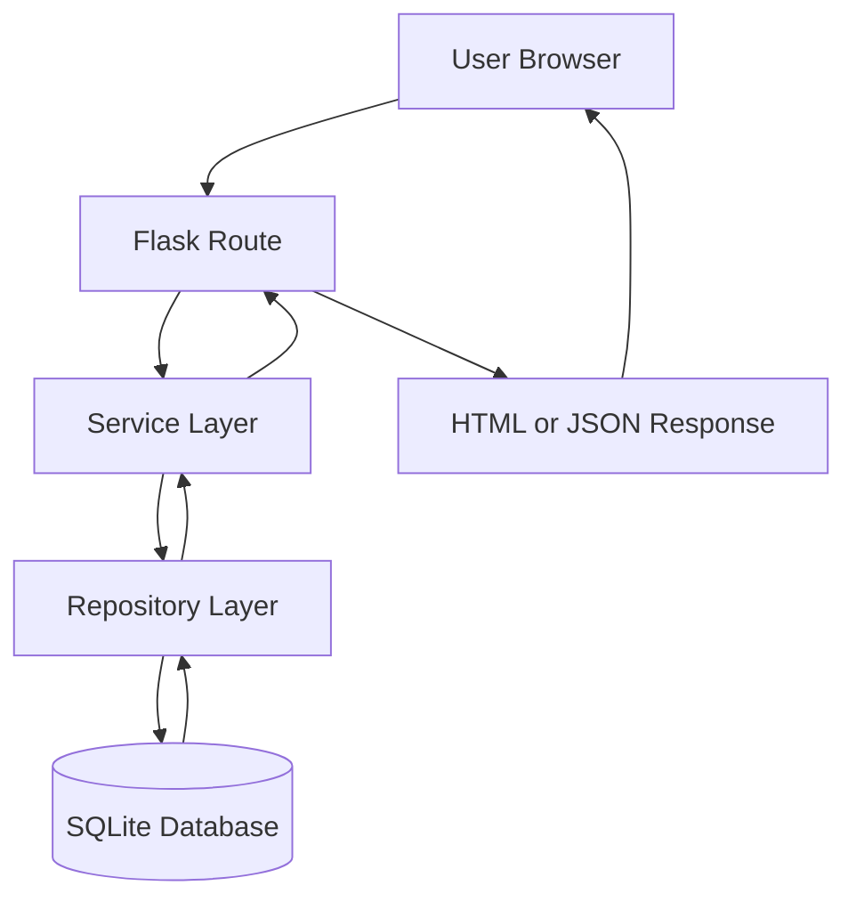
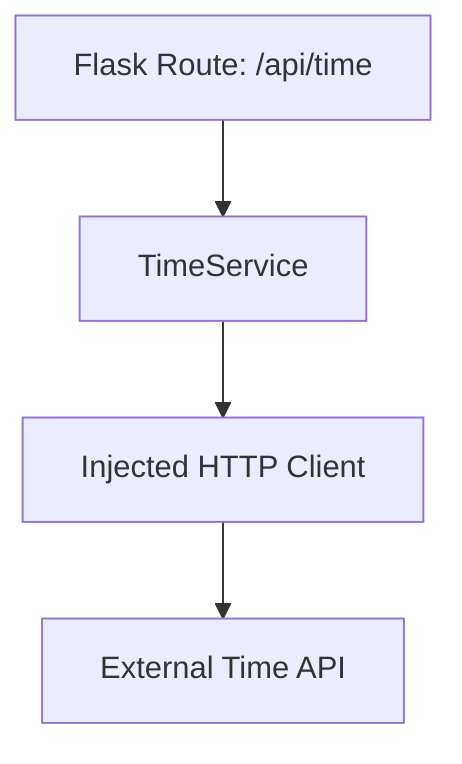
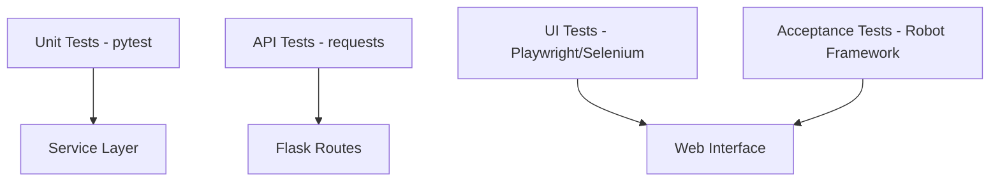
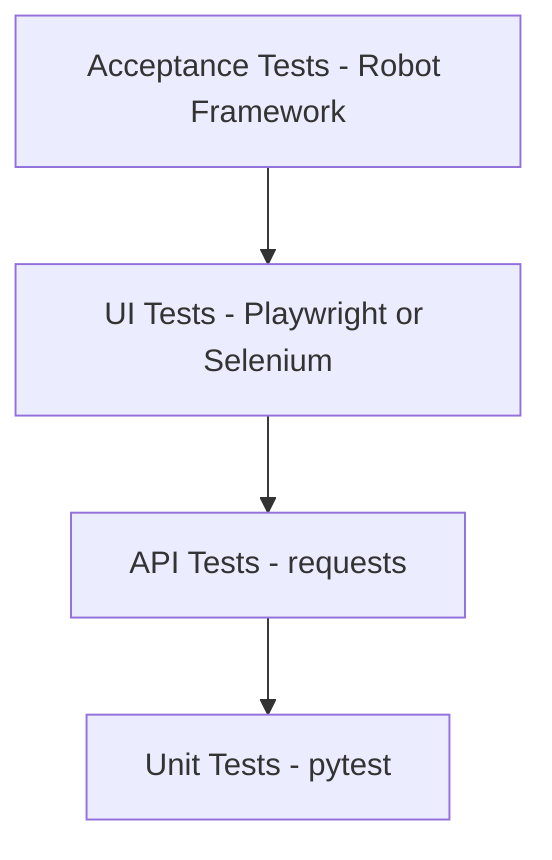

# Sprint 1 - Group Project
**Codebase Review and System Validation**

⚠️ **Pull requests must be created continuously during the sprint.  
Large end-of-sprint code dumps will receive reduced credit because they prevent proper CI validation and team review.**

---
## Initial Setup Checklist

1. Clone the Group Project repository
2. Create a Python virtual environment
3. Install requirements.txt
4. Run the Flask application locally
5. Run pytest and confirm tests pass
6. Open the GitHub Project board
7. Review assigned issues for Sprint 1
---

## Sprint Goal

The goal of Sprint 1 is for the team to understand and validate the inherited Task Tracker system before implementing new features. The sprint focuses on system onboarding, architecture review, and validation of the current implementation.

During the individual project phase, the application was developed through multiple sprints and now provides a **working baseline application** with layered architecture, database persistence, automated tests, and a web interface.

This sprint focuses on:

* understanding the existing architecture
* verifying the current system behavior
* reviewing the implemented features
* completing the Sprint 1 mini lab: Improving TimeService Testability
* preparing the team to continue development in later sprints

The team should treat this sprint as a **handoff from a previous development team**.

---

## Project Requirement Alignment (Sprint 1)

Sprint 1 is an onboarding and baseline-validation sprint.

According to `group_project.md`, formal implementation of PR-1 through PR-10 occurs in Sprint 2-4.

Sprint 1 prepares the team to execute those requirements by:

* validating the inherited system and architecture
* confirming baseline test execution and local setup
* reviewing backlog/user stories and planning Sprint 2 requirement work
* establishing team workflow for PR-driven development and continuous pull requests

---

## Educational Context

In real software development environments, teams frequently inherit existing codebases. Engineers must first:

1. understand the architecture
2. review existing features
3. validate system behavior
4. identify areas for improvement

Sprint 1 simulates this real-world onboarding process.

You will work as a **new development team** responsible for maintaining and extending an existing application.

---

## System Architecture Overview

The Task Tracker application follows a **layered architecture pattern**.
Each layer has a clear responsibility, which improves maintainability and testability.



This architecture allows developers to modify individual layers without affecting the entire system.

---

## Core Application Structure

The main components of the application are organized as follows:

```
app/
 ├── routes/
 │    ├── tasks.py
 │    ├── health.py
 │    └── time.py
 │
 ├── services/
 │    ├── task_service.py
 │    └── time_service.py
 │
 ├── repositories/
 │    └── database_task_repository.py
 │
 ├── models/
 │    └── task.py
 │
 ├── templates/
 │    ├── add_task.html
 │    ├── task_list.html
 │    └── report.html
 │
 └── __init__.py
```
---

## Task Tracker File Map

The following diagram shows how the major files in the project correspond to the system architecture.


---

## File Locations in the Project

The diagram above corresponds to the following files in the repository.

| Layer      | File                                           | Purpose                        |
| ---------- | ---------------------------------------------- | ------------------------------ |
| Route      | `app/routes/tasks.py`                          | Handles task API requests      |
| Route      | `app/routes/time.py`                           | Handles external time endpoint |
| Route      | `app/routes/health.py`                         | Health monitoring endpoint     |
| Service    | `app/services/task_service.py`                 | Task business logic            |
| Service    | `app/services/time_service.py`                 | External API integration       |
| Repository | `app/repositories/database_task_repository.py` | Database operations            |
| Model      | `app/models/task.py`                           | Task data structure            |
| Database   | SQLite                                         | Persistent storage             |

---

## How Requests Move Through These Files

Example request:

```
POST /api/tasks
```

Flow through the system:

```
tasks.py
   ↓
TaskService
   ↓
DatabaseTaskRepository
   ↓
Task Model
   ↓
SQLite Database
```

The response then returns back through the same layers to the client.

---

## Why This Diagram Is Important

This diagram helps developers quickly answer questions like:

* Where do I add a new endpoint?
* Where does business logic go?
* Where is database access implemented?
* Which files control task behavior?

Understanding this structure makes it much easier to extend the application.

---

## Request Flow Through the System

The following diagram shows how requests move through the application.



Example request:

```
POST /api/tasks
```

The request travels through the route, service, and repository layers before reaching the database.

---

## Implemented System Components

The inherited system already includes the following major components.

| Layer         | Component              | Description                |
| ------------- | ---------------------- | -------------------------- |
| Web Framework | Flask                  | Application server         |
| Architecture  | Flask Blueprints       | Modular route structure    |
| Services      | TaskService            | Business logic for tasks   |
| Services      | TimeService            | External API integration   |
| Repository    | DatabaseTaskRepository | Database persistence       |
| Database      | SQLite + SQLAlchemy    | ORM-based storage          |
| UI            | Flask Templates        | Browser interface          |
| Testing       | pytest                 | Unit and integration tests |
| Testing       | requests               | API testing                |
| Testing       | Playwright/Selenium             | UI automation              |

---

## External API Integration

The application demonstrates integration with an external service that retrieves the current time from the `timeapi.io` external time API.

The application retrieves the current UTC time using an external API service. If the external API is unavailable, the system falls back to the local system clock.

This feature illustrates how software systems can consume external APIs while keeping the application architecture modular and testable.

## Request Flow

In the application, requests for time information follow this flow:

```
Client Request
      ↓
Flask Route (/api/time)
      ↓
TimeService
      ↓
External Time API (timeapi.io)
      ↓
Response Returned to Client
```

## Design Rationale

The external API call is implemented inside the **TimeService** rather than directly in the route.

This approach provides several benefits:

* **Separation of concerns** – routes handle HTTP requests, while services handle business logic.
* **Improved testability** – external calls can be mocked during testing.
* **Maintainability** – the API provider can be changed without modifying route logic.

---

## Implemented System Features

The following capabilities were implemented during the Individual Project and are available in the starter code.

---

### Task Management API

The application exposes a REST API for task management.

| Endpoint                 | Description                |
| ------------------------ | -------------------------- |
| GET `/api/tasks`         | Retrieve all tasks         |
| POST `/api/tasks`        | Create a new task          |
| PUT `/api/tasks/<id>`    | Update a task              |
| DELETE `/api/tasks/<id>` | Delete a task              |
| POST `/api/tasks/reset`  | Reset tasks (testing only) |

These endpoints are implemented in the **task routes blueprint**.

---

### Health Monitoring Endpoint

The system includes a simple health endpoint for monitoring.

```
GET /api/health
```

Example response:

```
{
 "status": "ok"
}
```

This endpoint confirms that the application is running correctly.

---

### Web User Interface

The application includes a browser-based interface built with Flask templates.

| Page        | Route           | Description            |
| ----------- | --------------- | ---------------------- |
| Create Task | `/tasks/new`    | Add a new task         |
| Task List   | `/tasks`        | View all tasks         |
| Task Report | `/tasks/report` | Summary of task status |

The UI allows users to:

* create tasks
* mark tasks complete
* delete tasks
* view a task summary report

---

### Database Persistence

Tasks are stored using **SQLite with SQLAlchemy**.

Key characteristics:

* tasks persist between application restarts
* ORM model defines task structure
* repository layer abstracts database operations

Example task fields:

```
id
title
completed
created_at
```

---

### Dependency Injection

The application uses **dependency injection** to improve testability and maintainability.

Services are injected when the application is created.

Example:

```
create_app(task_service=TaskService(...))
```

This design allows services to be replaced with **mock implementations during testing**.

The following mini lab introduces a small architectural refactor that improves the testability of the TimeService.
---
## Sprint 1 Mini Lab – Improving TimeService Testability

As part of Sprint 1, the team will complete a short refactoring exercise that improves the **testability of the TimeService**.

The current implementation retrieves time data from an external API using the `requests` library. While functional, directly calling the HTTP client makes automated testing more difficult.

The mini lab introduces **dependency injection for the HTTP client**, allowing tests to replace the external API call with a mock implementation.

### Lab Document

Detailed instructions for this activity are provided in:

```
sprint1-group-mini-lab.md
```

### Purpose of the Mini Lab

This activity reinforces several key software engineering concepts used throughout this project:

* dependency injection
* service layer design
* mock testing
* external API isolation

### Architectural Concept

The mini lab modifies the service so that the HTTP client can be injected.

This allows the service to use a **mock HTTP client during automated testing** instead of calling the real external API.



**Conceptual flow:**

```
Flask Route (/api/time)
      ↓
TimeService
      ↓
Injected HTTP Client
      ↓
External Time API
```

During automated tests, the HTTP client can be replaced with a **mock client**, allowing tests to run without calling the real external API.

---

### Automated Testing

The project includes multiple automated testing layers. Robot Framework will be required as part of the Group Project.

| Test Type        | Tool                  | Purpose                    |
| ---------------- | --------------------- | -------------------------- |
| Unit Tests       | pytest                | test service logic         |
| API Tests        | pytest + requests     | test API endpoints         |
| UI Tests         | Playwright / Selenium | automate browser workflows |
| Acceptance Tests | Robot Framework       | validate user workflows    |


Additional testing frameworks may be added in future sprints.

---

## Testing Architecture

The project includes multiple automated testing layers.



These tests ensure the application remains stable as new features are added.

---

## Testing Pyramid

The automated tests in this project follow the **testing pyramid** model used in many software engineering teams.



### Testing Layers

| Level            | Focus                      | Tools                 |
| ---------------- | -------------------------- | --------------------- |
| Acceptance Tests | end-to-end user workflows  | Robot Framework       |
| UI Tests         | browser interface behavior | Playwright / Selenium |
| API Tests        | REST endpoint validation   | pytest + requests     |
| Unit Tests       | business logic             | pytest                |

---

### Why This Matters

The testing pyramid encourages developers to:

* write **many fast unit tests**
* use **API tests to verify integration**
* use **UI tests selectively**
* reserve **acceptance tests for full system validation**

This approach keeps the test suite **fast, reliable, and maintainable**.

---

### How It Applies to This Project

| Layer           | Example                             |
| --------------- | ----------------------------------- |
| Unit Test       | testing `TaskService.add_task()`    |
| API Test        | testing `POST /api/tasks`           |
| UI Test         | automating task creation in browser |
| Acceptance Test | validating full user workflow       |

---

## Sprint 1 Team Kickoff Checklist

Before beginning development work, the team should complete the following setup tasks.

### Repository Setup

Each team member should:

```
□ Clone the project repository
□ Run the application locally
□ Verify that the web UI loads
□ Run the automated tests
```

---

### GitHub Project Setup

The team should organize their work using GitHub Issues.

```
□ Create an Epic issue for the Sprint 1 mini lab
□ Create 3 sub-issues for the mini lab tasks
□ Assign each issue to a team member
□ Create feature branches for each issue
```

---

### Development Workflow

The team should follow a simple collaborative workflow.

```
1. Create issue
2. Create branch
3. Implement change
4. Submit Pull Request
5. Team review
6. Merge
```

This ensures that the team practices **professional GitHub workflow during development**.

---

### Suggested Task Assignment

For the mini lab, the team may divide work as follows:

| Team Member | Suggested Task                                   |
| ----------- | ------------------------------------------------ |
| Developer 1 | Refactor `TimeService` for HTTP client injection |
| Developer 2 | Implement `MockHTTPClient`                       |
| Developer 3 | Create unit tests for the service                |

The team should review and test the final implementation together.

---

## Team Responsibilities for Sprint 1

During this sprint, the team should focus on **understanding and validating the system**.

Recommended tasks include:

* cloning and running the application
* verifying API endpoints
* exploring the code structure
* reviewing architecture documentation
* running automated tests
* validating UI workflows

The goal is to ensure the team is comfortable working with the inherited system before implementing new features.

---

## Sprint 1 Level Acceptance Criteria

Sprint 1 is considered complete when the team has:

* completed the Sprint 1 mini lab
* successfully run the application locally
* verified that the UI and API function correctly
* executed the automated test suite
* reviewed the architecture and documentation
* documented any issues discovered during system validation

---

## Definition of Done

Sprint 1 is complete when:

* all team members understand the architecture
* the system has been successfully validated
* documentation has been reviewed
* the team is ready to begin feature development in Sprint 2

---
### Sprint 1 Deliverables

```
• System successfully runs locally
• Automated tests executed
• Sprint 1 mini lab completed
• Team architecture review completed
• Issues documented in GitHub
• Sprint 2 planning started
```

# Sprint 1 GitHub Issue Structure

## Sprint 1 Epic Issue Template

### Title

```
Sprint 1 – Codebase Review and System Validation
```

### Description

```
Sprint 1 focuses on understanding and validating the inherited Task Tracker system before implementing new features.

Objectives:

• review the system architecture
• verify that the application runs locally
• execute the automated test suite
• complete the Sprint 1 mini lab
• prepare the team for feature development in Sprint 2
```

---

### Deliverables

```
• application runs locally
• automated tests executed successfully
• Sprint 1 mini lab completed
• architecture reviewed by the team
• issues created for future sprint work
```

---

### Definition of Done

```
• team members successfully run the application locally
• automated tests execute without errors
• Sprint 1 mini lab completed and merged
• pull requests reviewed and approved
• team understands system architecture
```

---

## Sprint 1 Sub-Issue 1 – System Setup and Validation

### Title

```
Verify Local Environment and System Setup
```

### Description

```
Each team member must verify that the application runs locally and that the development environment is configured correctly.
```

### Tasks

```
• clone repository
• install dependencies
• run Flask application
• verify web interface loads
```

### Validation

```
• UI loads in browser
• API endpoints respond correctly
```

---

## Sprint 1 Sub-Issue 2 – TimeService Refactor (Mini Lab)

### Title

```
Refactor TimeService for HTTP Client Injection
```

### Description

```
Complete the Sprint 1 mini lab to improve the testability of the TimeService by injecting the HTTP client used to call the external API.
```

### Tasks

```
• modify TimeService constructor
• allow HTTP client injection
• update service logic to use injected client
```

### Validation

```
• service functions correctly
• external API calls still work
```

---

## Sprint 1 Sub-Issue 3 – Automated Test Verification

### Title

```
Verify Existing Automated Tests
```

### Description

```
Run the automated test suite and verify that the inherited tests pass successfully.
```

### Tasks

```
• run pytest
• verify API tests execute
• verify UI tests execute
```

### Validation

```
• all tests pass successfully
• CI pipeline executes without errors
```

---

## Recommended Sprint 1 Workflow

```
1. Create Sprint 1 Epic
2. Create three sub-issues
3. Assign issues to team members
4. Create branches for each issue
5. Implement changes
6. submit pull requests
7. conduct team code review
8. merge changes
```

---

## Example Sprint 1 Issue Map

```
Epic: Sprint 1 – Codebase Review

    ├─ System Setup and Validation
    ├─ TimeService Refactor (Mini Lab)
    └─ Automated Test Verification
```
